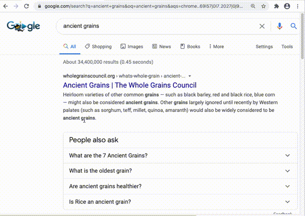

# *Nightingale*

*Nightingale* is a Chrome browser extension that fills the web with literary pop-up ads containing lines from Keats's 1819 odes ("Ode to Psyche," "Ode on Indolence," "Ode on Melancholy," "Ode to a Nightingale," "Ode on a Grecian Urn," and "To Autumn").

The resonances between lines of Keats's verse and fragments of web pages are painstakingly encoded as a series of [136 regular expressions](https://github.com/kbooten/nightingale/blob/master/extension/patterns.js), each itself a close-reading that tries to consider what echoes there may be between the specific lines and sites I might visit.  For instance, web-text matching the regular expression:

>`/\b[A-Z]\w+d (songs|melodies) are\b|\bthose \w+ are \w+er\b|\b\w+s are sweet\b/i`

will trigger a pop-up containing the lines:

>Heard melodies are sweet, but those unheard  
>Are sweeter  

## Adding it to your browser

*Nightingale* is highly personalized software; the regular expressions that match web-text to Keats's odes encode my no-doubt idiosyncratic interpretations of this verse.  Still, Chrome users can install the extension by 

1. navigating to `chrome://extensions/`
2. clicking "Load Unpacked"
3. loading this repo's folder `extension`

Should someone else want to use *Nightingale* to fill their experience of the internet with literature other than Keats, `extension/patterns.js` can simply be filled with other `(regex, quote)` pairs. 

## Other considerations

*Nightingale* assumes that seeing the same lines from Keats pop up too frequently could breed resentment. It tracks in `localStorage` when a particular quotation from Keats was last inserted as a pop-up into a page I have visited, and the quotation will only reappear after a certain amount of time has elapsed (by default, 3 days). 

